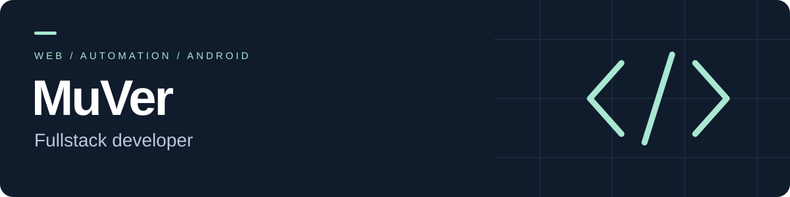
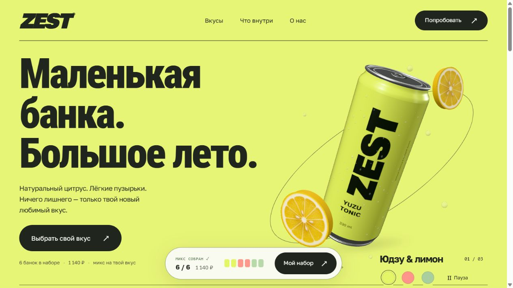
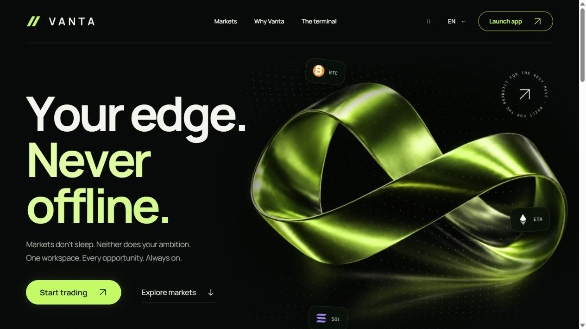

Разрабатываю сайты и веб-приложения: интерфейсы на **React и Next.js**, серверную часть на **Python и Django**. Работаю с интерактивной графикой, Telegram-ботами и развёртыванием сервисов на Linux.

**Открыт к удалённой работе и проектным задачам.**

### Избранные проекты

<table>
<tr>
<td width="50%" valign="top">

<h3><a href="https://github.com/Murad-big/zest-3d-landing">ZEST ↗</a></h3>

Лендинг вымышленного бренда напитков. Вращение 3D-банки, смена вкуса и конструктор набора из шести банок с сохранением выбора.

<code>JavaScript</code> <code>Three.js</code> <code>HTML / CSS</code>

</td>
<td width="50%" valign="top">

<h3><a href="https://github.com/Murad-big/vanta-trading">VANTA ↗</a></h3>

Анимированный лендинг и учебный терминал: свечной график, заявки, позиции и виртуальный баланс. Русский и английский интерфейсы.

<code>React</code> <code>Vite</code> <code>Canvas</code>

</td>
</tr>
</table>

ZEST и VANTA - демонстрационные проекты. Покупка напитков и реальные торговые операции не подключены.

### Ещё работы

| Проект | Что реализовано | Технологии |
| --- | --- | --- |
| [ForSTUDENT](https://github.com/Murad-big/ForSTUDENT) | Расписание ИУБиП, выбор группы, виджеты и будильник к первой паре | Kotlin, Jetpack Compose, Room |
| [Telegram-задачник](https://github.com/Murad-big/TG-ChatZadachnik) | Задачи, ответственные, сроки, напоминания, Excel и Google Таблицы | Python, Telegram Bot API |
| [ParserWithSQL](https://github.com/Murad-big/ParserWithSQL) | Асинхронный сбор карточек товаров и изображений, сохранение в SQLite | Python, aiohttp, aiosqlite |
| [Tetris](https://github.com/Murad-big/tetris-game) | Игровое поле, фигуры, очки и увеличение сложности | JavaScript, Canvas |

**СЕНСЕЙ / WhiteSensei** - участвовал в разработке [сайта логистического сервиса](https://white-cargo-sensei.ru/): услуги, этапы работы с грузом и пошаговая заявка с прикреплением файлов. Стек: Next.js, React, TypeScript.

### Стек

| Направление | Инструменты |
| --- | --- |
| Frontend | JavaScript, TypeScript, React, Next.js, HTML, CSS, Vite |
| Backend и автоматизация | Python, Django, Telegram-боты, SQLite |
| Интерактивная графика | Three.js, Canvas, 3D-сцены и анимация |
| Серверы | Linux, VPS, SSH, Docker, systemd, Caddy, HTTPS |
| Android | Kotlin, Jetpack Compose |

В репозиториях есть инструкции по запуску, описание возможностей и текущих ограничений.
